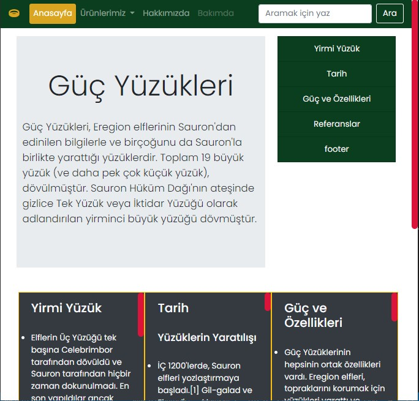

# Bootstrap İlk Repo

Bu repo Bootstrap projesi için yaptığım ilk ödevin reposu. İçerisinde bir adet README yedi adet html ve bir adet de css dosyası barındırıyor. Ayrıca bir adet img klasörü vardır ve içerisinde dokuz adet jpg uzantılı görsel bulunmaktadır.


## Intallation
Öncelikle projeyi klonlayın.

```
 https://github.com/Yucel-Ozkaya/Guc_yuzukleri 
```
## Usage
Projeyi klonladıktan sonra Visual Studio Code  programında açınız.

Linux İçin:

```
cd Guc_yuzukleri
 code .
```

## Contributing

Pull requestler kabul edilir. Büyük değişiklikler için, lütfen önce neyi değiştirmek istediğinizi tartışmak için konu açınız.

## Licese

[MIT](/Guc_yuzukleri/LICENSE)